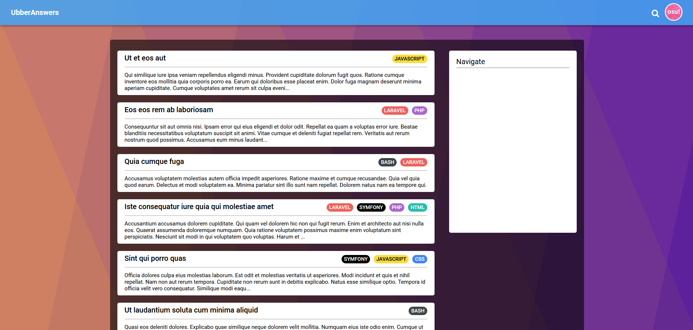

# QA Website

**Project on the same principle as the StackOverflow or Quora site. Users can sign up to ask and answer questions.**

### - - - - - - - - - - - - - - - - - - -

## Additional docs

**[Application mockup](https://www.figma.com/file/6gf7N2G7k97br12bVO8m30/QAWebsite?node-id=0%3A1)**

**[Conceptual Data Model](docs/MCD.md)** / **[Data Dictionnary](docs/DD.md)**

**[Kanban](https://trello.com/b/Rn90Wuab/qawebsite)**