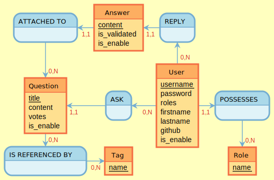

`````
ATTACHED TO, 0N> Question, 11< Answer
Answer: content, is_validated, is_enable
REPLY, 11> Answer, 0N< User
:

Question: title, content, votes, is_enable
ASK, 11> Question, 0N< User
User: username, password, roles, firstname, lastname, github, is_enable
POSSESSES, 0N> Role, 11< User

IS REFERENCED BY, 0N> Tag, 0N< Question
Tag: name
:
Role: name
`````

